## By Seal Team 9

- Lily Nguyen
- Bill Cao
- Mario Guerrieri

# Summary
*have?* is a mobile and smartwatch application that allows anonymous users to consult crowdsourced healthcare professionals to check for potential STDs. When you have concerns about your sexual health, *have?* Experts are there to set your mind at ease. Just enter your symptoms, and *have?* suggests possible conditions. Submit a photo, and let *have?* Experts take care of the rest!

# Screenshots
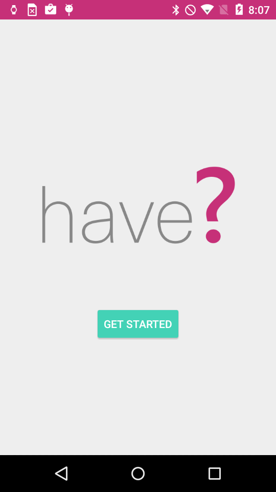
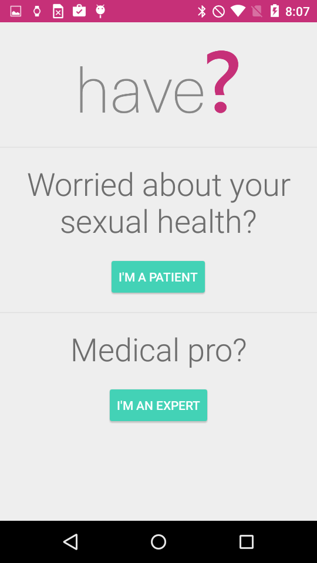
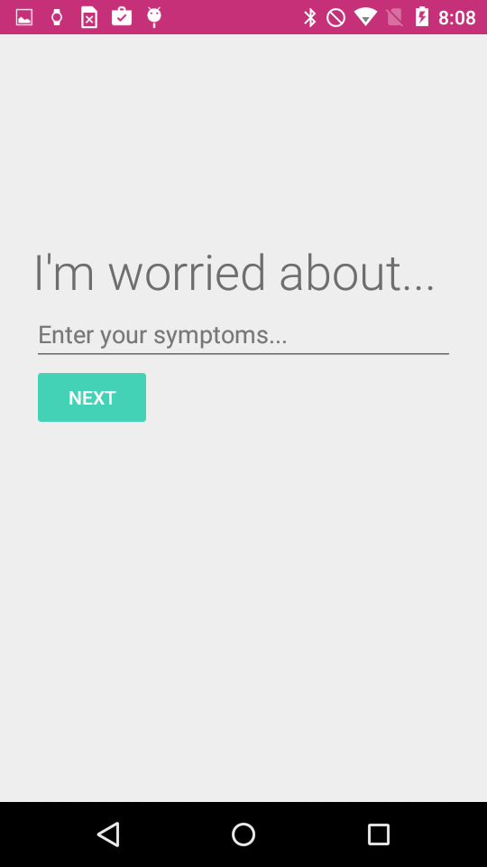
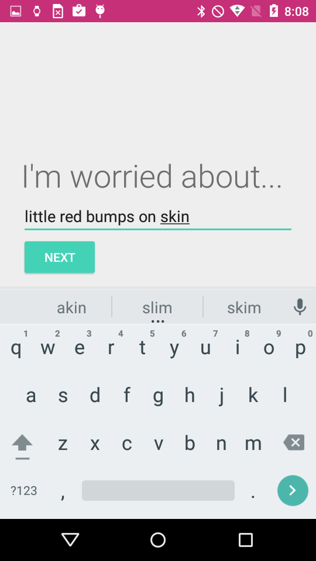
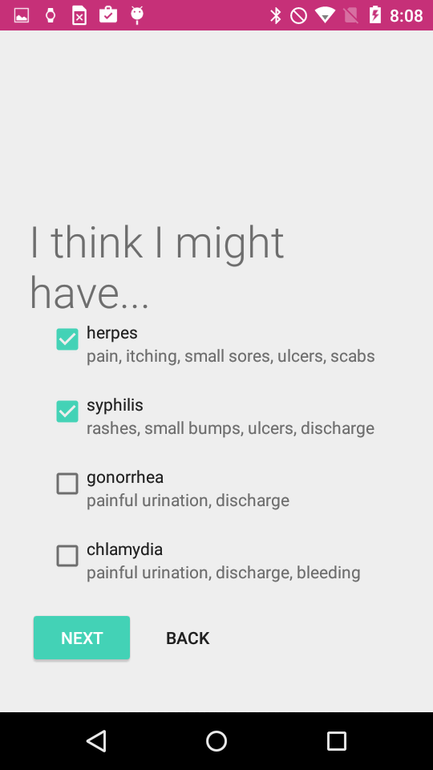
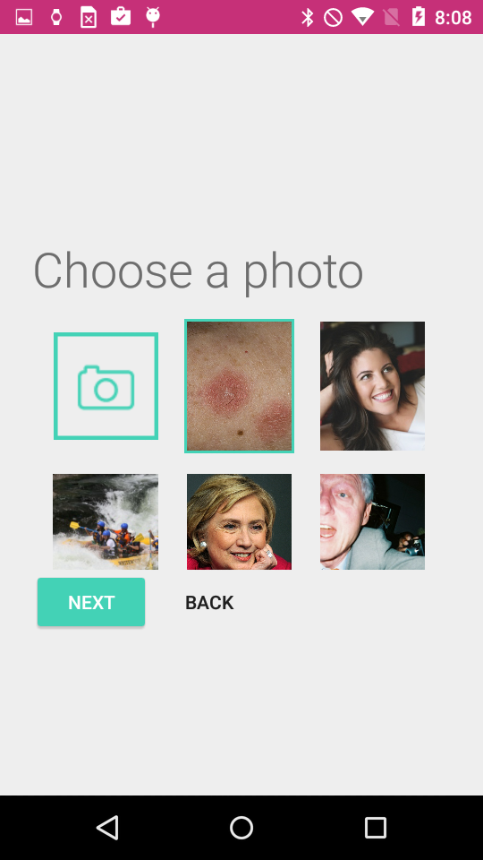
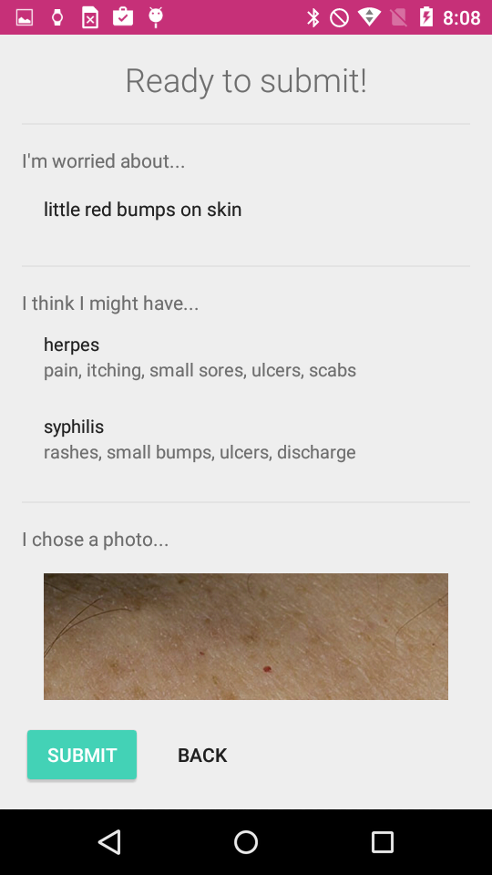
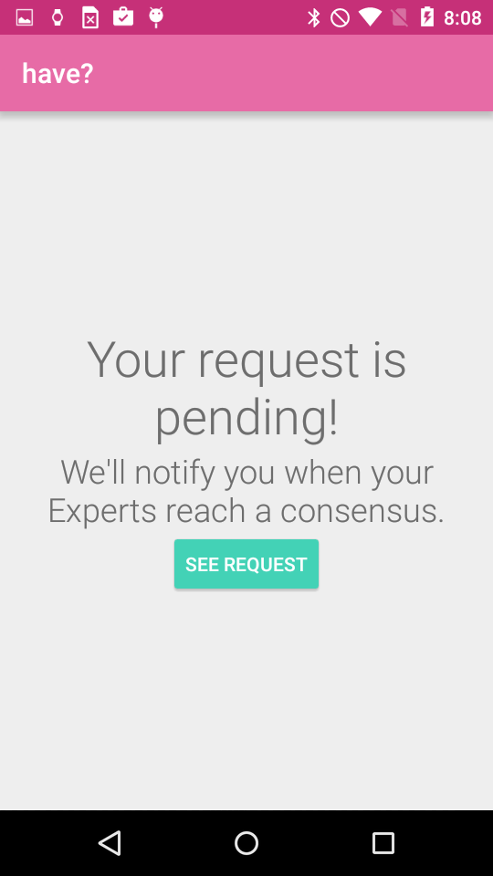
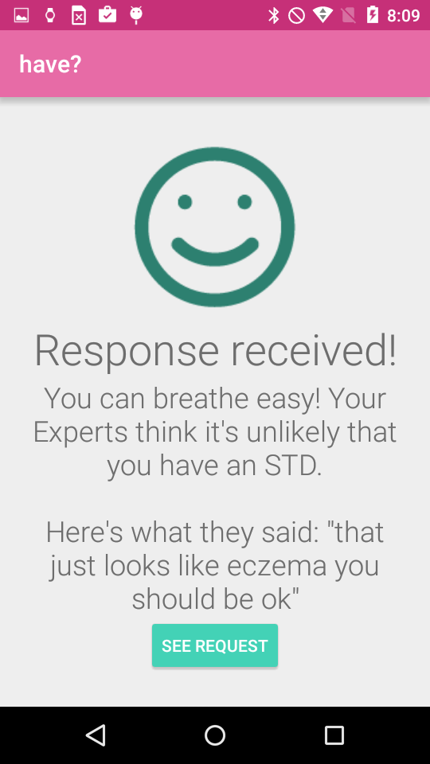

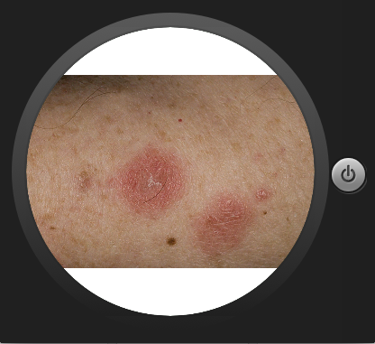
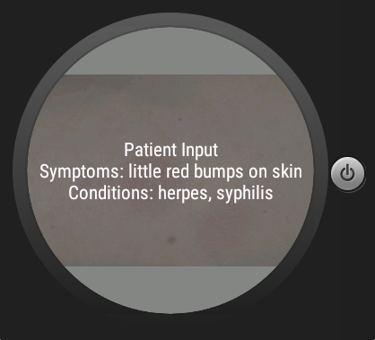
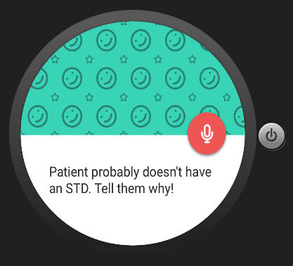
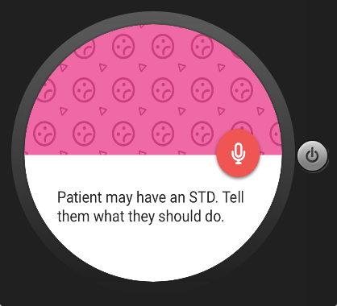
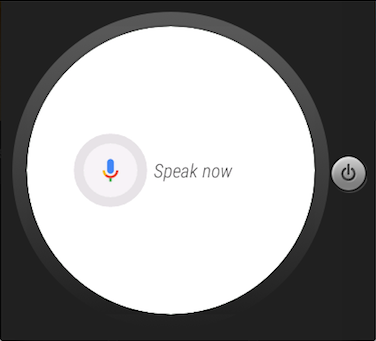